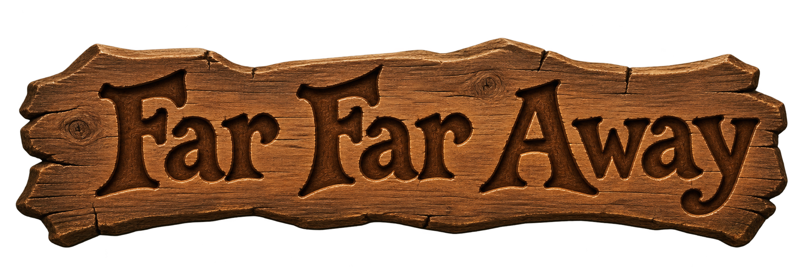

<p align="center">
  
</p>


# FFA

FFA stands for Far Far Away. It is an engine that runs an Unreal Engine 2
game's original data, in the way OpenMW runs Morrowind's, and the tools that
work out what that data is. Shrek 2 PC is the game it was proven on, but
nothing in it is tied to one game.

The project has two halves in one repository:

- **The engine**, in C++20 with the standard library only, built with CMake:
  `src/`, `apps/` and `tests/`. It starts where a game starts, with its script:
  the first part is a virtual machine for UnrealScript bytecode, loaded
  straight from the game's `.u` packages.
- **The tools**, in Python with the standard library only, in `tools/`. They
  open the container, decompile UnrealScript back to source, read class
  defaults, and assemble whole levels from their BSP, static meshes and
  terrain. Every format is worked out here first and proven against the whole
  game before the engine implements it. The tools are never part of the
  engine's build; its tests use them to check what they read.

[docs/package-format.md](docs/package-format.md) is the contract between the
two: what the tools established, which the engine reimplements.
[docs/script-vm.md](docs/script-vm.md) is how the engine executes the script.

Nothing here was taken from an existing implementation. Every format was
recovered by measurement, and every reader has to prove itself against the whole
corpus before it is committed. How that is done is the subject of
[CONTRIBUTING.md](CONTRIBUTING.md), and it is the part of this project worth
copying even if the code is not.

## Disclaimer

This project uses AI to write code and documentation. All code and documentation generated by the AI are reviewed and tested by a human.

## The engine

### Building

```sh
cmake -S . -B build -G Ninja
cmake --build build
ctest --test-dir build --output-on-failure
```

The tests need Python 3: `tests/fixtures.py` writes small packages whose
script has known results, and reads each one back with the Python readers in
`tools/` before the engine sees it.

### Running against a game

```sh
build/ffa-script check $SYS                       # load and compile everything, report
build/ffa-script call  $SYS GameInfo.ParseOption '?Name=Bob?Class=X' Name
build/ffa-script smoke $SYS                       # call every static function once
build/ffa-script level $SYS ../Maps/1_Shreks_Swamp.unr   # load a level's live actors
build/ffa-script start $SYS ../Maps/1_Shreks_Swamp.unr   # begin play: game, events, player
build/ffa-script run   $SYS ../Maps/1_Shreks_Swamp.unr 20  # then twenty seconds of it
build/ffa-script collide $SYS ../Maps/*.unr               # check the collision against the data
build/ffa-play $SYS ../Maps/1_Shreks_Swamp.unr            # play it in a window (SDL2, GL ES 2)
build/ffa-play $SYS/..                                    # the game from its start: logos, menu
```

`$SYS` is a game's `System` directory, or that of Epic's freely available
UnrealEngine2 Runtime (see getting a corpus, below).

`check` is the corpus-wide proof the VM rests on, as end alignment is for the
readers. It loads every class and builds its default object, and compiles every
function and state, which resolves every reference a token carries and requires
every jump to land on the start of a statement. It then tests two readings that
come from knowledge of the engine rather than from measurement, against what
the bytecode itself says:

- **The state tail.** A state's record ends in ProbeMask, IgnoreMask,
  LabelTableOffset and StateFlags, 22 bytes. `check` reports the tail length
  of every state, and whether LabelTableOffset points at the entries of the
  label table the bytecode walk found; on Shrek 2 both hold for all 968.
- **The conversion tokens.** The codes after the 0x39 cast prefix are the
  engine's published conversions. `check` tallies the declared type of every operand each
  token is given; IntToString should only ever be handed ints.

It also lists the natives the script calls that are not implemented yet, most
called first, which is the work list for the next step.

### How it is put together

| File | What it does |
|--|--|
| `src/core/Package` | The container: header, names, imports, exports |
| `src/core/Name` | Case blind names, compared as integers |
| `src/script/Bytecode` | Bytecode to token trees, with memory offsets; port of `uscript.py` |
| `src/script/Tagged` | Tagged property lists; port of the reader in `udefaults.py` |
| `src/script/Linker` | Imports resolved by path; classes, functions, states, structs; defaults |
| `src/script/Types` | Values, declared types, objects |
| `src/script/VM` | The interpreter: calls, states, latent actions, iterators |
| `src/script/NativesCore` | Object's natives: operators, maths, strings, states |
| `apps/ffa_script.cpp` | The command line above |

How each part of the language executes, and on what authority, is in
[docs/script-vm.md](docs/script-vm.md).

### Where it stands

The VM runs the language: virtual, final, global, super and static calls,
states with BeginState and EndState, state code with labels, goto and latent
actions, foreach over native iterators with break and continue, switch with
fall through, out and optional parameters, skip parameters for `&&` and `||`,
delegates, structs and static and dynamic arrays with the engine's copy and
bounds behaviour, casts, `new`, and accessing members of none. 55 tests over
the fixture packages cover each of these.

It has not yet been run on a real corpus. That is the next step, and
`ffa-script check` is built for it.

Not done yet, roughly in order:

- Engine natives: Actor, Level, spawning, timers, the tick. Script cannot run a
  level until the Actor natives exist; `check` lists them by how often they are
  called.
- Config and localisation: `.ini` and `.int` files, `config` and `localized`
  variables, `Localize`.
- Loading a level: its actors as objects, with their state frames, from the
  `.unr` records `tools/umap.py` already reads.
- Probe masks and `ignores`, replication, and garbage collection.
- Speed: the interpreter walks token trees, which is simple and easy to check
  but slower than the flat bytecode the engine runs.

## The tools

### What it reads

| Tool | What it does |
|--|--|
| `tools/upkg.py` | Package container: header, name table, imports, exports |
| `tools/uscript.py` | UnrealScript bytecode, as token trees with disk and memory offsets |
| `tools/uclass.py` | Classes, properties, states, function signatures, enums |
| `tools/udefaults.py` | Default property blocks, and the tagged value format |
| `tools/udecompile.py` | Renders a class back to readable UnrealScript |
| `tools/umap.py` | Actors of a level and their properties |
| `tools/uini.py` | Text files: configuration, localisation, subtitles and cutscene scripts |
| `tools/umesh.py` | Static mesh geometry: vertices, normals, UVs, colours, triangles |
| `tools/ubsp.py` | BSP: level vectors, points, nodes, surfaces and verts |
| `tools/upolys.py` | Polys: the editor's polygons of a brush, what volumes are made of |
| `tools/ulevel.py` | Assembles a level: BSP polygons and placed static meshes |
| `tools/ulight.py` | Baked lighting of placed static meshes |
| `tools/umaterial.py` | Materials: from shaders and modifiers down to the base texture |
| `tools/utexture.py` | Textures: every format the game uses, decoded to RGBA and PNG |
| `tools/ufont.py` | Fonts: glyph rectangles over texture pages, in both layouts |
| `tools/usound.py` | Sounds: the Bink and WAV files inside, and their lip sync data |
| `tools/uterrain.py` | Terrain: heightmaps, holes, and the world transform |
| `tools/uskel.py` | Skeletal meshes: reference pose and skeleton |
| `tools/uanim.py` | Animations: bones, keyframe tracks, sequences, playback |
| `tools/ugallery.py` | Browser gallery of skeletal meshes with animations playing |
| `tools/uview.py` | Writes a level as a self contained HTML viewer |
| `tools/natives.py` | Which engine natives a game's script actually calls |

Pure Python, standard library only, no dependencies.

### Where it stands

Measured against Shrek 2 PC (package version 129) and the freely available
UnrealEngine2 Runtime (version 126):

- **Script.** All 8638 functions parse to the exact end of their record and
  agree with their declared script size. 2002 classes
  decompile, with signatures, bodies and defaults.
- **Defaults.** Every class of both corpora, 2002 and 607, with every property
  name resolving to a real inherited property.
- **Levels.** Across all 29 Shrek 2 maps, 36111 objects parse. The 16406 that do
  not are exactly the engine classes with native payloads: Model and Polys (the
  BSP), StaticMeshInstance, TerrainSector.
- **Meshes.** All 835 static meshes, 122011 vertices and 102414 triangles,
  read to the exact end of every record, collision included: a BSP tree over
  the collision triangles, and for 312 a collision model of their own.
- **BSP.** All 2727 Model records, with 32690 nodes, 18539 surfaces and 602807
  verts, every reference in range, read up to the lightmaps: zones, bounds,
  leaves, convex hulls and light lists. A point's zone and whether it is solid
  come from walking the tree, checked against the zone table and against where
  19580 live actors stand.
- **Lighting.** Every placed mesh's baked vertex light, 9260 records, to their
  end, with its channel order taken from the lights themselves. The BSP's
  render sections, matched to every node's polygon, and its lightmaps with
  their shadow bitmaps and DXT1 atlases, the matrices checked on all 134302
  lit corners. Every BSP Model now reads to the end of its record.
- **Level.** All 29 Level records, to their exact end: the live actor list, the
  URL and the level's Model. Actors the list leaves out, 8572 of them, are
  deleted ones the editor saved anyway, all marked bDeleteMe.
- **Terrain.** All 22 terrains read to the end of their records, with the
  heightmap to world transform proven twice, against the engine's 1360 stored
  sector boxes and against its stored copy of every vertex, the quad split
  settled by its stored normals, and the baked light of every vertex.
- **Skeletal meshes.** All 141, with four LOD models each, every index in range,
  standing upright in their reference pose, and all 1031 placed in levels.
  Characters stand on the ground; props with no mesh origin float by about
  their collision height. That offset is not in the script, the animations or
  the mesh data, which leaves native code.
- **Textures.** All 2121, in every format the game uses, decoded.
- **Fonts.** All 120, in the two layouts package versions 99 to 129 use,
  every glyph inside its page, and drawn as readable text.
- **Text.** All 199 text files: configuration, subtitles tied to the dialogue
  sounds they caption, bump line sets, menus, and 180 cutscene scripts whose
  Say and PlayMusic commands were checked against the game's sounds and music.
- **Sounds.** All 3769, Bink Audio and WAV stored whole, every one decoding
  in FFmpeg, with the lip sync block after each read as far as its third
  version, which is not decoded yet.
- **Materials.** Shaders, blends and modifiers followed down to their texture.
  Of the 11429 static meshes placed in the levels, every section with triangles
  finds its texture except 7 whose material slot is empty.
- **Animations.** All 134 animation sets, 1574 sequences and 1.7 million
  rotation keys, read to the exact end of every record, and played back by
  skinning, with the quaternion convention established by measurement.
- **Levels assembled.** BSP, placed static meshes and terrain together, viewable
  in a browser, with orientation, rotation and terrain holes checked against the
  game itself.

The level viewer draws BSP, static meshes and characters with their textures,
terrain with its blended texture layers, and the sky as the game does, as a
background seen from the SkyZoneInfo; the gallery draws its characters
textured. Not done yet: animation inside the level viewer, the rest of the BSP
record, and structuring the decompiler's control flow into `if` and `for`
rather than labels and gotos.

### The command line

`ffa` at the root of the repository puts the tools behind one command:

```sh
./ffa info      $SYS/Engine.u                         # what a package holds
./ffa list      ../Textures/SHCharacters.utx -c Palette
./ffa extract   ../Textures/SHCharacters.utx -o out    # textures as PNG
./ffa sounds    ../Sounds/Shrek.uax -o out             # sounds as .wav and .bik
./ffa text      ../System/HpDialog.int All pc_nar_StoryBook1_16   # one subtitle
./ffa font      ../Textures/SH_Fonts.utx SHBigInkFont "Far Far Away"   # out/SHBigInkFont.png
./ffa decompile $SYS Engine.u Pawn                    # one class, or --all -o DIR
./ffa defaults  $SYS Engine.u Pawn
./ffa actors    ../Maps/1_Shreks_Swamp.unr SkyZoneInfo
./ffa view      ../Maps/7_Prison_Donkey.unr           # out/7_Prison_Donkey.html
./ffa gallery   ../Animations                         # out/gallery
./ffa check     <game dir>                            # every corpus check, capped at 6 GB
```

Packages that refer to others, a texture's palette or a level's meshes, are
found by walking up from the package to the directory that holds `System`.

### Running

```sh
cd tools
SYS=../corpus

python3 upkg.py       $SYS/*.u                       # record counts per package
python3 uscript.py    $SYS/*.u                       # parse rate and both checks
python3 uclass.py     $SYS/Engine.u Actor            # one class, declarations
python3 udecompile.py $SYS Engine.u Pawn             # one class with bodies
python3 udefaults.py  $SYS Engine.u Pawn             # one class's defaults
python3 umap.py       ../Maps                        # object counts per level
python3 umesh.py      ../StaticMeshes                # geometry totals
python3 umaterial.py  ..                             # every static mesh's materials
python3 ubsp.py --zones ../Maps                      # BSP zones against every actor's Region
python3 ubsp.py --solid ../Maps                      # solid or empty under every actor
python3 ubsp.py --lightmaps ../Maps                  # lightmap matrices against every lit polygon
python3 upolys.py --check ../Maps/*.unr              # brush polygons to the end of every record
python3 uview.py      ../Maps/7_Prison_Donkey.unr ../out/prison.html
python3 ugallery.py   ../Animations ../out/gallery   # one page per skeletal mesh
```

The gallery skins every mesh on the CPU in JavaScript with a line by line port of
the Python playback, checked against it numerically: the two agree to 1e-13
units. Space plays or pauses, comma and period step a frame, the square brackets
change sequence, the arrows orbit, W and S zoom, and PageUp and PageDown move
between meshes.

The viewer is a noclip camera: W A S D to move, E or Space up, Q or C down, the
arrow keys to look, Shift to go faster, R back to the overview, and B, M, T and K
to toggle BSP sides, static meshes, terrain and skeletal meshes, the last off
when a page opens. Y shows the sky
where it really stands instead of as the background. L cycles the light: baked
light doubled, which compared by eye with the game is the closer, baked light
as stored, and plain viewer lighting. Keys are read by physical
position, so they work on any keyboard layout. Pages draw only when something
changes, so an open tab that is not being used costs nothing.

The viewer output contains the game's own geometry, so it goes to the gitignored
`out/` and is for looking at your own copy only.

A bulk run is worth capping, for reasons [CONTRIBUTING.md](CONTRIBUTING.md)
explains:

```sh
( ulimit -v 3000000; python3 udecompile.py $SYS SHGame.u --all out )
```

## Getting a corpus

The tools need package files to run against, and this repository ships none.

Epic's UnrealEngine2 Runtime is free to download and makes a legal corpus anyone
can obtain:

```sh
curl -LO https://archive.org/download/ue2runtime_inst/UE2Runtime-22262002_Demo.exe
7z e -ocorpus UE2Runtime-22262002_Demo.exe 'System/*.u'
```

For a game you own, point the tools at its `System`, `Maps` and `StaticMeshes`
directories.

## The format

[docs/package-format.md](docs/package-format.md) documents what was recovered:
compact indices, the file header, class, property, function and enum records,
the bytecode and its opcode table, default properties, levels, and static
meshes. It also lists what is still unknown.

Facts about a file format are not anyone's property, so that document is free to
use whatever licence the code carries.

## Credits

UE Viewer by Konstantin Nosov covers UE1 to UE4 assets and is MIT licensed. No
code from it is used here, but it is a far more complete asset exporter and an
excellent independent check on anything this project claims about meshes.
